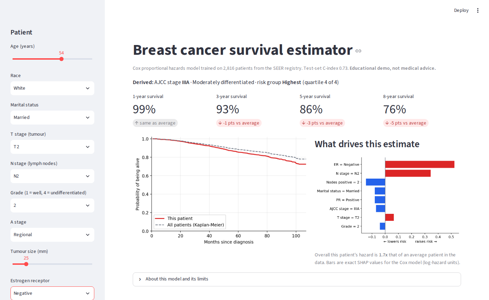
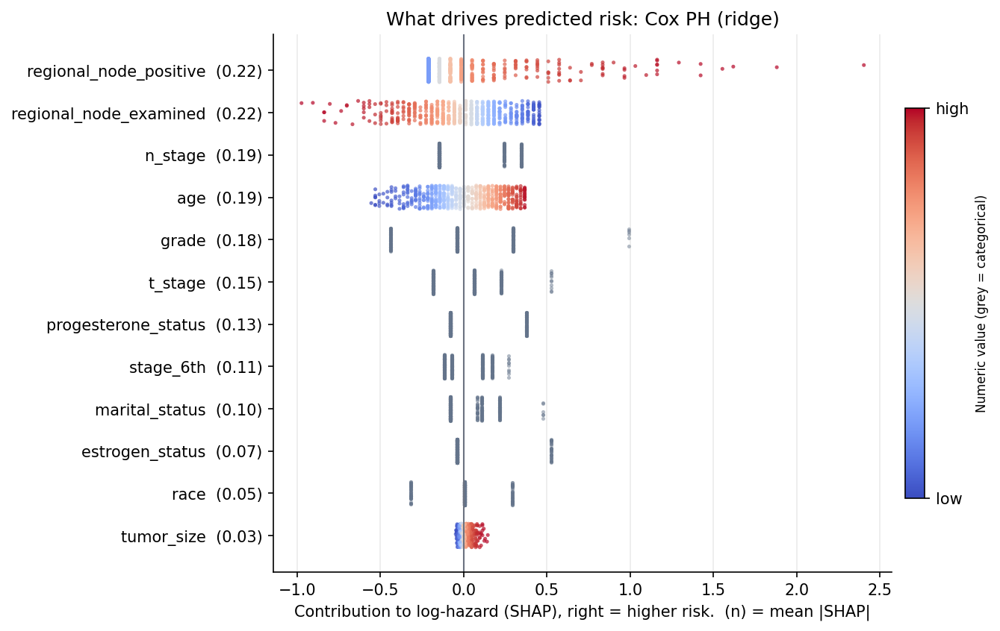
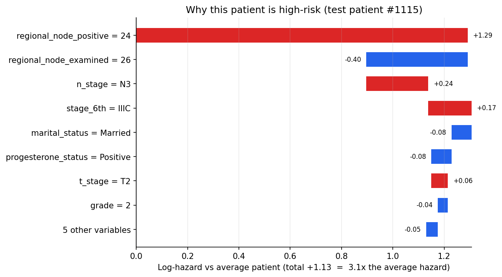

# Breast Cancer Survival Prediction

[](https://github.com/GnanithaG/Breast-cancer-prognosis-prediction/actions/workflows/ci.yml)


**Can routine clinical data predict breast cancer survival better than cancer staging alone?**
Yes: a penalised Cox model using 13 clinical variables ranks patients' risk significantly better
than the AJCC stage group that clinicians use today (C-index 0.727 vs 0.658, p = 0.004), and an
interactive app explains every individual prediction.



## Highlights

- **4,023 patients** from the US SEER cancer registry, 616 deaths, up to 107 months of follow-up.
- **Clinically grounded question:** every model is compared with an *AJCC stage only* baseline,
  using a paired bootstrap test on the same held-out patients.
- **Four models:** stage-only baseline, Cox proportional hazards (ridge), Random Survival Forest,
  gradient-boosted Cox. Hyper-parameters tuned on a validation split; the test split is used once.
- **Censoring-aware evaluation:** Uno's C-index, time-dependent AUC, IPCW Brier score, integrated
  Brier score, bootstrap 95% CIs, calibration, and a Kaplan-Meier reference.
- **Explainable:** exact SHAP values and hazard ratios for the Cox model, globally and per patient.
- **Interactive demo:** a Streamlit app that estimates a patient's survival curve and explains it.
- **Tested and reproducible:** 19 tests, lint and a full pipeline smoke test run on every push.

## Key result: does the model beat staging?

| Model | Uno's C (95% CI) | Harrell's C | IBS (95% CI) | IBS skill vs KM | AUC 12m | AUC 36m | AUC 60m | AUC 96m |
|---|---|---|---|---|---|---|---|---|
| AJCC stage only (baseline) | 0.658 (0.602-0.719) | 0.663 | 0.095 (0.079-0.112) | +5.3% | 0.726 | 0.692 | 0.633 | 0.646 |
| **Cox PH (ridge)** | **0.727 (0.681-0.786)** | 0.738 | 0.089 (0.074-0.105) | +11.3% | 0.824 | 0.780 | 0.729 | 0.701 |
| Random Survival Forest | 0.708 (0.658-0.764) | 0.724 | 0.090 (0.075-0.106) | +10.9% | 0.827 | 0.775 | 0.713 | 0.651 |
| Gradient Boosted Cox | 0.724 (0.679-0.779) | 0.730 | 0.089 (0.073-0.106) | +11.5% | 0.826 | 0.782 | 0.715 | 0.685 |

*Held-out test set, n = 604. Cox was chosen as the final model by its validation score.*

- **The model adds real information beyond staging.** Paired on the same test patients, the Cox
  model's C-index is **0.069 higher** than stage alone (95% CI 0.027 to 0.113, p = 0.004), and it
  roughly **doubles** the error reduction over a no-information model (IBS skill 11.3% vs 5.3%).
- **Complex models don't help here.** The forest and boosting models are no better than the
  linear Cox model, which is also the easiest to explain. That's a useful finding in itself:
  with 14 tabular variables, the signal is mostly additive.

**How to read the metrics:** a C-index of 0.73 means that for a random pair of patients, the model
ranks the one who dies first as higher-risk 73% of the time (0.5 = coin flip). *IBS skill* is how
much the model reduces prediction error compared with giving everyone the population survival curve.

| Discrimination and error over time | Calibration (Cox) |
|---|---|
|  |  |


Patients in the model's highest-risk quarter died at about 7 times the rate of those in the lowest.

## What drives risk



For a Cox model the risk score is linear, so SHAP values are **exact** (no sampling): each dot is one
test patient, and its position shows how much that variable raised or lowered their hazard.

- **Lymph nodes dominate.** More positive nodes means much higher risk. Given the same number of
  positive nodes, *more nodes examined* lowers risk: a lower positive ratio, and likely more thorough surgery.
- **Hormone receptors matter:** estrogen-negative (HR 1.76) and progesterone-negative (HR 1.58)
  tumours carry substantially higher risk, a factor stage grouping ignores.
- **Tumour grade** is a strong factor (grade 3 HR 1.40, grade 4 HR 2.81 vs grade 2), followed by
  age and nodal stage; tumour size adds little once nodes and T stage are known.
- **Race and marital status** carry signal (e.g. Black patients HR 1.33 vs White), most likely
  reflecting differences in access to care rather than biology, which is worth noting for fairness.

Full table: [`reports/hazard_ratios.md`](reports/hazard_ratios.md). A worked single-patient example:



## Interactive demo

```bash
pip install -r requirements.txt
streamlit run app.py
```

Pick a patient's characteristics in the sidebar to see their predicted survival curve against the
population, 1/3/5/8-year survival, their risk quartile, and which factors drive the estimate. The app
refits the tuned model from the repo's data on start-up (about a second), so there's no pickled model to
go stale. The AJCC stage group is derived automatically from T and N stage so inputs stay consistent.

**Deploy it for free:** push the repo to GitHub, sign in at [share.streamlit.io](https://share.streamlit.io),
choose *New app*, pick this repository and `app.py`, then click *Deploy*. Put the resulting link at the
top of this README.

## Data

A public extract of the **SEER** registry: women diagnosed 2006-2010 with infiltrating duct and
lobular carcinoma, widely shared as `Breast_Cancer.csv`. Variables: age, race, marital status,
T/N/AJCC-6th stage, grade, SEER summary stage, tumour size, estrogen and progesterone status, lymph
nodes examined and positive; outcome is months of follow-up and alive/dead status. A duplicate
`differentiation` column (a relabelling of grade) is dropped.

Cohort characteristics: [`reports/eda/table1_cohort.md`](reports/eda/table1_cohort.md).


## Method

```
Breast_Cancer.csv
   │  load + clean   (snake_case names, status → 0/1, grade codes fixed, duplicates removed)
   ▼
stratified split 70 / 15 / 15  (by stage × outcome, frozen in configs/split_indices.json)
   │
   ├─ train ──► preprocessing (impute, scale, one-hot) + model  ─┐
   ├─ val   ──► pick hyper-parameters by Uno's C-index  ◄────────┘
   └─ test  ──► final metrics, bootstrap CIs, stage comparison, SHAP (used once)
```

| Model | Inputs | Tuned on validation |
|---|---|---|
| AJCC stage only (baseline) | stage group only | - |
| Cox PH with ridge penalty | all 13 variables | `alpha` |
| Random Survival Forest (300 trees) | all 13 variables | `min_samples_leaf`, `max_features` |
| Gradient-boosted Cox (200 stages) | all 13 variables | `learning_rate`, `max_depth` |

## Reproduce

```bash
git clone https://github.com/GnanithaG/Breast-cancer-prognosis-prediction.git
cd Breast-cancer-prognosis-prediction
python -m venv .venv && source .venv/bin/activate   # Windows: .venv\Scripts\activate
pip install -r requirements.txt

python run_pipeline.py          # train, tune, evaluate, explain -> reports/  (~2 min)
python scripts/eda.py           # cohort tables and figures -> reports/eda/
streamlit run app.py            # interactive demo
```

Options: `python run_pipeline.py --help` (e.g. `--models cox,rsf --n-boot 0` for a quick run).
Tests: `pip install -r requirements-dev.txt && pytest`

## Project structure

```
├── app.py                     # Streamlit demo
├── run_pipeline.py            # end-to-end training, evaluation, explanations
├── scripts/eda.py             # Table 1, data quality, exploratory figures
├── src/
│   ├── data/                  # ingest.py, harmonize.py, splits.py
│   ├── preprocessing/         # sklearn ColumnTransformer
│   ├── models/                # registry.py (models + tuning), serving.py (for the app)
│   ├── evaluation/            # metrics.py, plots.py, explain.py (SHAP, hazard ratios), importance.py
│   └── reporting/             # metrics.json, results table, model card
├── tests/                     # pytest suite (runs in CI)
├── configs/split_indices.json # frozen split (with a data fingerprint)
├── data/Breast_Cancer.csv
├── docs/                      # README images
└── reports/                   # generated outputs, committed for browsing
```

## Limitations

- **Population:** everyone in this extract is node-positive (N1-N3) and aged 30-69, so the model
  says nothing about node-negative, younger or older patients.
- One registry, no external validation; results may not transfer to other populations or eras.
- Outcome is all-cause death, not breast-cancer-specific death.
- Key prognostic information is missing: treatment, HER2 status, Ki-67 and comorbidities.
- Race and marital status likely act as proxies for access to care; a deployed tool would need a
  fairness review before using them.
- This is a research and learning project, **not** a clinical tool.

## Changelog

**v1.1**: stage-only baseline with a paired bootstrap test; exact SHAP explanations and hazard
ratios; Streamlit demo app; duplicate `differentiation` column dropped.

**v1.0**: fixed the original pipeline (crash on default settings, all patients read as censored under
pandas 3, possible outcome leakage, a mislabelled C-index, Brier scores and calibration that ignored
censoring); added validation tuning, proper survival metrics, tests, CI and documentation.
