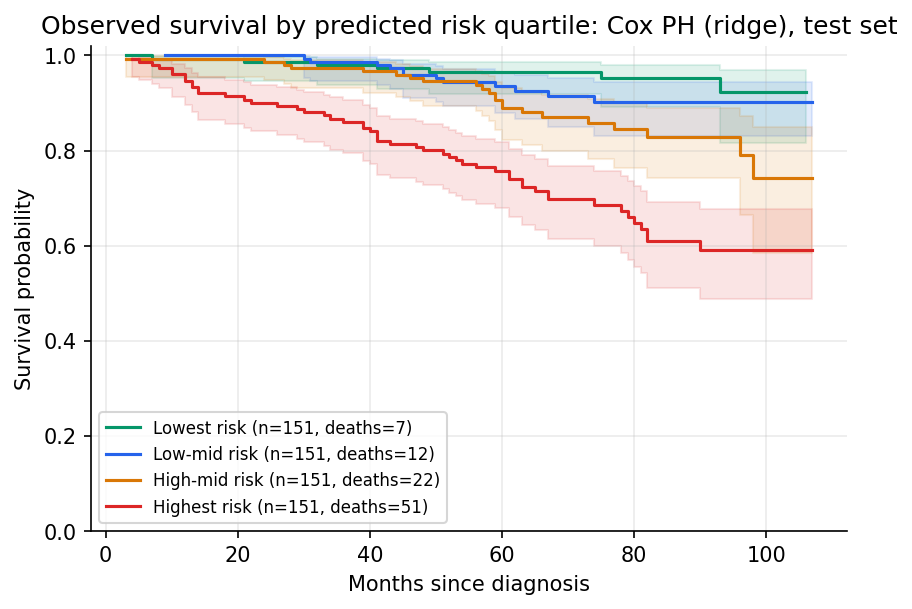
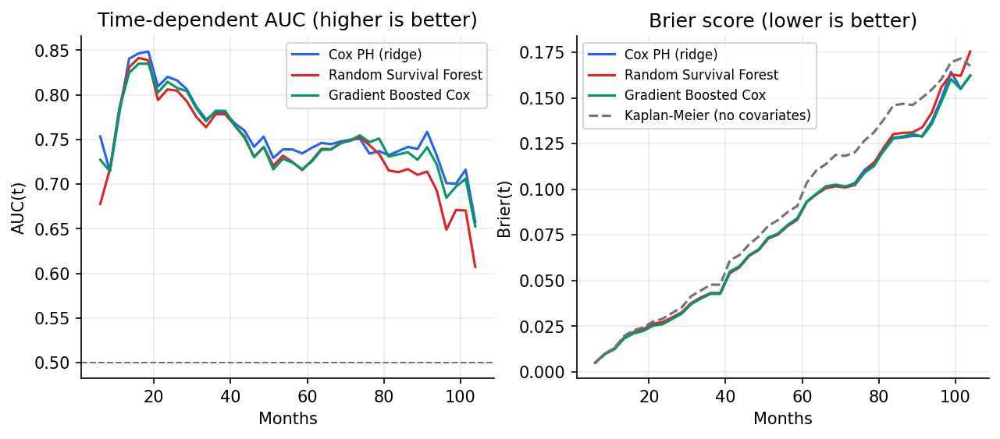
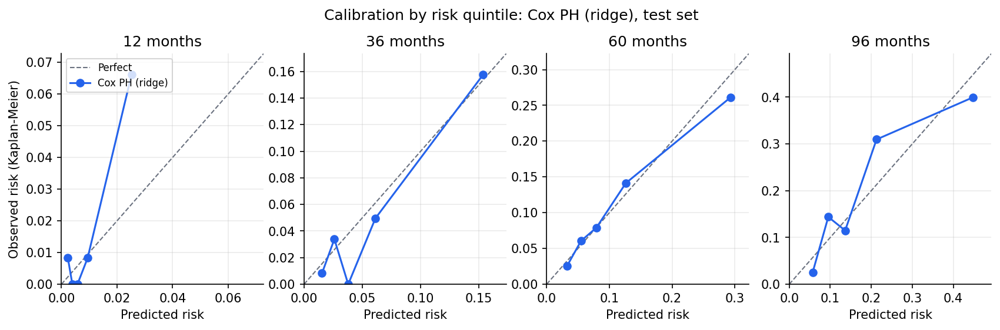
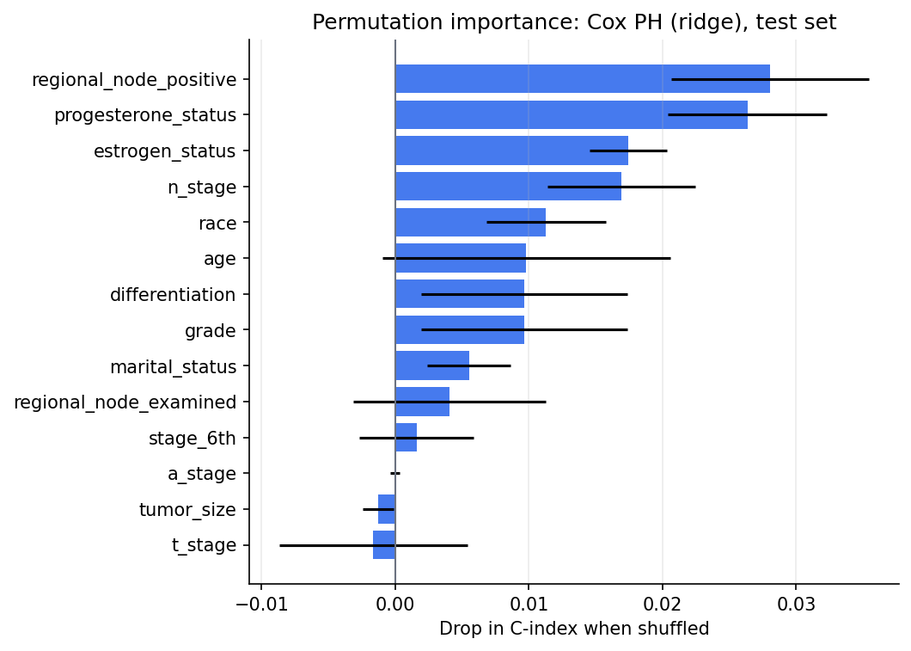
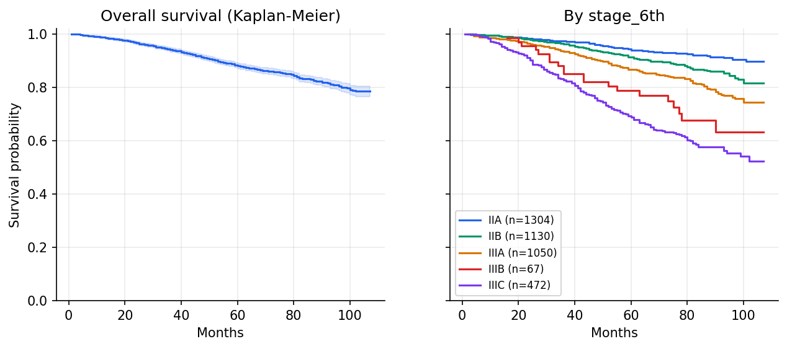

# Breast Cancer Survival Prediction

Predicting overall survival for women with breast cancer from routine clinical variables,
using three survival models evaluated with censoring-aware metrics.



## Highlights

- **4,023 patients**, 616 deaths (15.3%) over up to 107 months of follow-up.
- Three models compared: **Cox proportional hazards (ridge)**, **Random Survival Forest**, and **gradient-boosted Cox**.
- Hyper-parameters tuned on a validation split; the test split is used once for final numbers.
- Metrics that handle censoring properly: Uno's C-index, time-dependent AUC, IPCW Brier score,
  integrated Brier score, all with bootstrap 95% confidence intervals and a Kaplan-Meier baseline.
- The simple penalised Cox model performs as well as the tree ensembles on this data.

## Results (held-out test set, n = 604)

| Model | Uno's C (95% CI) | Harrell's C | IBS (95% CI) | IBS skill vs KM | AUC 12m | AUC 36m | AUC 60m | AUC 96m |
|---|---|---|---|---|---|---|---|---|
| Cox PH (ridge) | 0.727 (0.682-0.786) | 0.738 | 0.089 (0.074-0.105) | +11.3% | 0.824 | 0.780 | 0.729 | 0.701 |
| Random Survival Forest | 0.705 (0.655-0.759) | 0.724 | 0.090 (0.075-0.105) | +10.8% | 0.828 | 0.778 | 0.715 | 0.649 |
| Gradient Boosted Cox | 0.724 (0.679-0.779) | 0.730 | 0.089 (0.073-0.106) | +11.5% | 0.826 | 0.782 | 0.715 | 0.685 |

**How to read this:** a C-index of 0.73 means that for a random pair of patients, the model ranks the one
who dies first as higher-risk about 73% of the time (0.5 = coin flip). *IBS skill* is how much the model
reduces prediction error compared with giving every patient the same population survival curve.
The confidence intervals overlap heavily, so the three models are not meaningfully different here.

Full numbers are in [`reports/metrics.json`](reports/metrics.json); the auto-generated
[model card](reports/model_card.md) lists tuned parameters and limitations.

| Discrimination and error over time | Calibration (Cox) |
|---|---|
|  |  |

The strongest predictors (permutation importance) are the number of positive lymph nodes,
progesterone and estrogen receptor status, and nodal stage:



## Data

A public extract of the US **SEER** cancer registry (women diagnosed 2006-2010 with infiltrating duct
and lobular carcinoma), widely shared as `Breast_Cancer.csv`. 14 clinical features: age, race,
marital status, T/N/6th-edition stage, differentiation and grade, tumour size, estrogen and progesterone
status, lymph nodes examined and positive. Outcome: months of follow-up and alive/dead status.

Cohort characteristics are in [`reports/eda/table1_cohort.md`](reports/eda/table1_cohort.md).



## Method

```
Breast_Cancer.csv
   │  load + clean   (snake_case names, status → 0/1, grade codes fixed, 1 duplicate removed)
   ▼
stratified split 70 / 15 / 15  (by stage × outcome, frozen in configs/split_indices.json)
   │
   ├─ train ──► preprocessing (impute, scale, one-hot) + model  ─┐
   ├─ val   ──► pick hyper-parameters by Uno's C-index  ◄────────┘
   └─ test  ──► final metrics, bootstrap CIs, figures (used once)
```

| Model | Tuned on validation |
|---|---|
| Cox PH with ridge penalty | `alpha` |
| Random Survival Forest (300 trees) | `min_samples_leaf`, `max_features` |
| Gradient-boosted Cox (200 stages) | `learning_rate`, `max_depth` |

## Quick start

```bash
git clone https://github.com/GnanithaG/breast-cancer-prognosis-prediction-project.git
cd breast-cancer-prognosis-prediction-project
python -m venv .venv && source .venv/bin/activate   # Windows: .venv\Scripts\activate
pip install -r requirements.txt

python run_pipeline.py          # train, tune, evaluate -> reports/  (~1-2 min)
python scripts/eda.py           # cohort tables and figures -> reports/eda/
```

Useful options:

```bash
python run_pipeline.py --models cox,rsf --n-boot 0     # faster, no confidence intervals
python run_pipeline.py --horizons 12,24,60 --seed 42   # different horizons / seed
python run_pipeline.py --help
```

Run the tests: `pip install -r requirements-dev.txt && pytest`

## Project structure

```
├── run_pipeline.py            # end-to-end training + evaluation
├── scripts/eda.py             # Table 1, data quality, exploratory figures
├── src/
│   ├── data/                  # ingest.py, harmonize.py, splits.py
│   ├── preprocessing/         # sklearn ColumnTransformer
│   ├── models/registry.py     # model definitions + validation tuning
│   ├── evaluation/            # metrics.py, plots.py, importance.py
│   └── reporting/             # metrics.json, results table, model card
├── tests/                     # pytest suite (runs in CI)
├── configs/split_indices.json # frozen split (with a data fingerprint)
├── data/Breast_Cancer.csv
└── reports/                   # generated outputs, committed for browsing
```

## Limitations

- One registry extract, no external validation; results may not transfer to other populations.
- Outcome is all-cause death, not breast-cancer-specific death.
- Key prognostic information is absent (treatment, HER2 status, comorbidities).
- Some features are near-duplicates (grade vs differentiation; T stage vs tumour size vs 6th stage).
- This is a research and learning project, **not** a clinical tool.

## Changelog

**v1.0** (this version) fixed several problems in the original code:

- The pipeline no longer crashed with default arguments (column name mismatch) and no longer
  silently treated every patient as censored under pandas 3.
- Raw outcome columns can no longer leak into the feature matrix.
- The reported "IPCW C-index" was actually Harrell's C; Uno's IPCW C is now computed, alongside
  time-dependent AUC. Brier scores and calibration now account for censoring (previously censored
  patients were counted as survivors).
- The validation split is now used for tuning; each model gets its own preprocessing pipeline.
- Splits are regenerated automatically if the data changes.
- Five overlapping report scripts were merged into `scripts/eda.py`; added tests, CI and this README.
